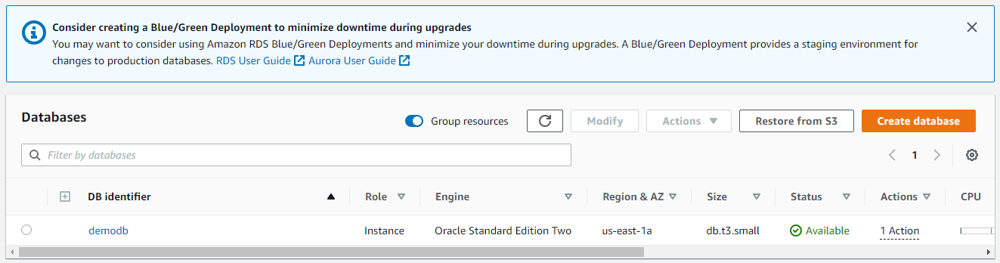

# AWS CDK Oracle Database

This project will create a Standard Oracle Database with AWS License.  
It is using a VPC with isolated subnet where the database will be created.  To run this please pass in your vpcId in the following format:

`cdk deploy vpcId=vpc-YOUR_VPC_ID`

Once the stack is deployed, you can view your database and access with applicable dbClient.

